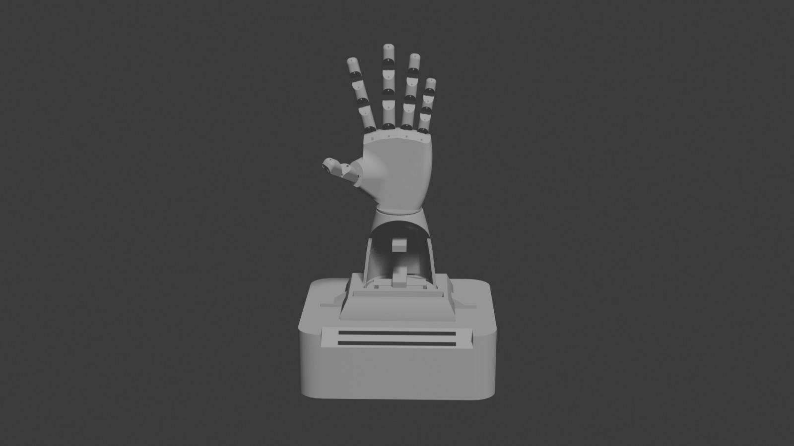
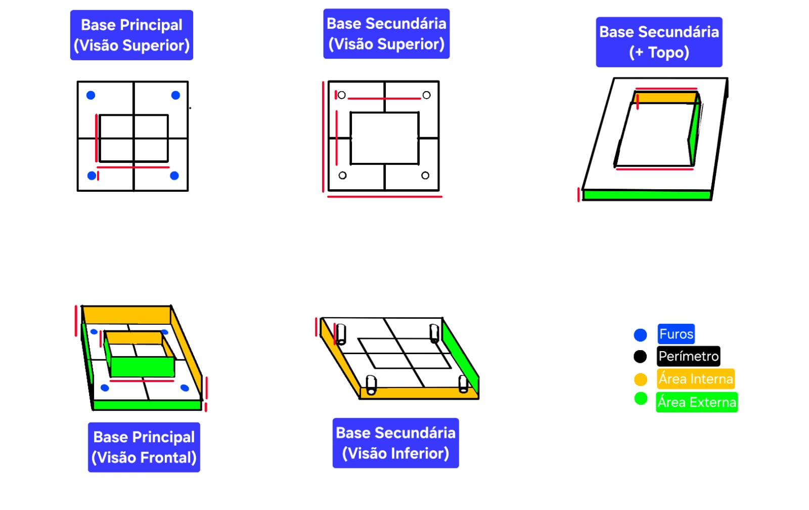
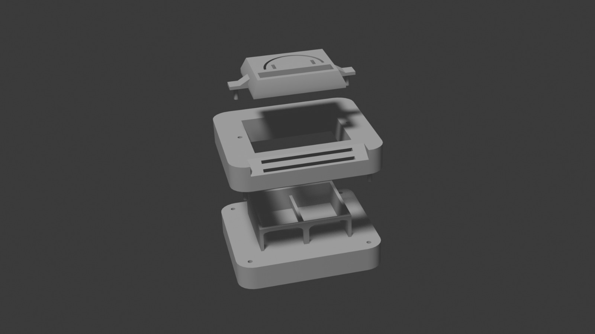
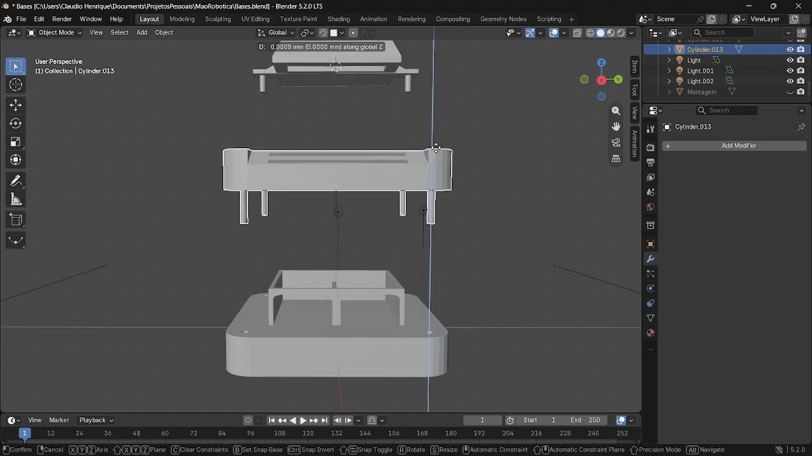

<h1 align="center">Robotic Hand</h1>

<p align="center">
  
</p>

<p align="center">
  Robotic hand developed as a school project using Arduino, C++, servo motors and 3D-printed components.
</p>

---

## About the Project

This is a **school project** developed for the **Embedded Systems** subject at **ETEC da Zona Leste (ETEC ZL)**.

The project consists of developing a functional **robotic hand** controlled by an Arduino and physical buttons. The hand combines **embedded programming, electronics, mechanical design, 3D printing and assembly** into a single practical project.

The project was collaboratively developed by the members of **CHEB-Labs**, a group of students from ETEC ZL, as an opportunity to apply concepts learned throughout the technical course in **Systems Development**.

---

## Objectives

The main objectives of the project are:

* Develop a functional robotic hand using Arduino.
* Control the hand's movements through physical buttons.
* Apply C++ programming to an embedded system.
* Integrate electronic and mechanical components.
* Design and manufacture the physical structure of the hand.
* Apply 3D printing techniques to manufacture mechanical components.
* Explore the integration between software and hardware.
* Develop teamwork and project organization skills.
* Document the development process and technical decisions.

---

## Project Status

**Status:** In Development

The project is being developed progressively, from the mechanical design and 3D printing to the electronic assembly, programming and testing.

* [x] Project planning
* [x] 3D modeling
* [x] 3D printing
* [ ] Mechanical assembly
* [ ] Electronic assembly
* [ ] Arduino programming
* [ ] Movement testing
* [ ] Final adjustments
* [ ] Final documentation
* [ ] Final demonstration

---

## How It Works

The robotic hand receives commands through **physical buttons** connected to the Arduino.

The Arduino processes these inputs using a program developed in C++ and controls the servo motors responsible for the hand's movements.

The system can be divided into three main layers:

<div align="center">

<pre>
┌─────────────────┐
│     Buttons     │
│    User Input   │
└────────┬────────┘
         │
         ▼
┌─────────────────┐
│     Arduino     │
│  C++ Processing │
└────────┬────────┘
         │
         ▼
┌─────────────────┐
│  Servo Motors   │
│ Movement Control│
└────────┬────────┘
         │
         ▼
┌─────────────────┐
│  Robotic Hand   │
│    Movement     │
└─────────────────┘
</pre>

</div>

---

## System Architecture

The general architecture of the project is represented below:


<div align="center">
<pre>
┌──────────────┐
│   BUTTONS    │
│  User Input  │
└──────┬───────┘
       │
       ▼
┌──────────────┐
│   ARDUINO    │
│     C++      │
└──────┬───────┘
       │
  ┌────┼────┐
  │    │    │
  ▼    ▼    ▼
┌────┐ ┌────┐ ┌────┐
│ S1 │ │ S2 │ │ S3 │
└─┬──┘ └─┬──┘ └─┬──┘
  │      │      │
  └──────┼──────┘
         ▼
┌──────────────┐
│ ROBOTIC HAND │
└──────────────┘
</pre>
</div>

The final architecture may be updated as the electronic assembly and control system are completed.

---

## Technologies

| Technology          | Purpose                                          |
| ------------------- | ------------------------------------------------ |
| **Arduino**         | Microcontroller platform and hardware control    |
| **C++**             | Embedded programming and movement logic          |
| **Arduino IDE**     | Development and programming environment          |
| **CAD Software**    | 3D modeling and mechanical design                |
| **FDM 3D Printing** | Manufacturing of structural components           |
| **Git & GitHub**    | Version control, collaboration and documentation |

---

## Hardware

The project uses a combination of electronic and mechanical components, including:

* Arduino board
* Servo motors
* Push buttons
* Connecting wires
* Power supply
* 3D-printed structural components
* Mechanical supports and joints

The complete list of components and their technical specifications will be documented as the project progresses.

---

## 3D Design & Manufacturing

The mechanical structure of the robotic hand was designed and manufactured by the team using **3D modeling and FDM 3D printing**.

The development process involved conceptual design, dimensional adjustments, 3D modeling, virtual assembly and manufacturing of the components.

### Mechanical Design

Before manufacturing the components, the mechanical structure was planned to define dimensions, mounting points and the positioning of the different parts.

<p align="center">
  
</p>

The design includes the main base, secondary base and top support, which were developed to accommodate the mechanical and electronic components of the project.

### 3D Modeling

The components were modeled in 3D before manufacturing, allowing the team to evaluate dimensions, positioning and assembly.

<p align="center">
  
</p>

The model was progressively developed to integrate the robotic hand, support structure and controller into a single assembly.

### 3D Assembly Preview

The virtual assembly was used to verify the positioning and interaction between the mechanical components before physical assembly.

<p align="center">
  
</p>

### 3D Printing

After the modeling and validation stages, the components were manufactured using **FDM 3D printing**.

<p align="center">
  
  
</p>

The printable files are organized in the `3d-models/` directory.

| Component | Material | Layer Height | Infill |
| --------- | -------- | ------------ | ------ |
| Palm      | PLA      | TBD          | TBD    |
| Forearm   | PLA      | TBD          | TBD    |
| Fingers   | PLA      | TBD          | TBD    |
| Base      | PLA      | TBD          | TBD    |

The manufacturing parameters will be updated as the printing process is finalized.

---

## Development

The project is being developed through several stages, allowing the team to document its progress from the initial design to the final working prototype.

### Mechanical Assembly

After the 3D-printed components were manufactured, the next stage is the mechanical assembly of the robotic hand and its support structure.

<p align="center">
  
  
</p>

Additional photos will be added as the physical assembly progresses.

### Electronic Assembly

The electronic components will be connected to the Arduino and integrated with the mechanical structure.

<p align="center">
  
</p>

The circuit diagram and wiring details will be documented in the `docs/schematics/` directory.

### Final Result

<p align="center">
  
</p>

The final result will be documented after the mechanical and electronic assembly is completed.

---

## Software

The robotic hand is programmed in **C++ using the Arduino IDE**.

The software is responsible for:

* Reading button inputs.
* Processing user commands.
* Controlling the servo motors.
* Managing the interaction between the inputs and hardware.
* Defining the programmed movements of the robotic hand.

The source code will be available in the `src/` directory.

---

## Demonstration

A demonstration of the completed robotic hand will be added after the mechanical and electronic assembly is finished.

The demonstration will show the hand responding to user input and performing its programmed movements.

<p align="center">
  
</p>

---

## Challenges & Solutions

During development, the team may encounter challenges involving **mechanical design, 3D printing, electronics, programming and assembly**.

These challenges and their solutions will be documented throughout the project.

<div align="center">

<table>
  <tr>
    <th>Challenge</th>
    <th>Solution</th>
  </tr>
  <tr>
    <td>TBD</td>
    <td>TBD</td>
  </tr>
  <tr>
    <td>TBD</td>
    <td>TBD</td>
  </tr>
  <tr>
    <td>TBD</td>
    <td>TBD</td>
  </tr>
</table>

</div>

This section will be updated as problems are identified and solved during development.

---

## Documentation

The complete technical documentation of the project will cover:

* Project planning
* Hardware and components
* Circuit and connections
* Mechanical structure
* 3D modeling
* 3D printing
* Software architecture
* Programming logic
* Mechanical assembly
* Development challenges
* Testing and results
* Individual contributions
* Possible improvements

The complete documentation will be available in the `docs/` directory.

---

## Future Improvements

Possible improvements for future versions of the project include:

* Improve movement precision.
* Optimize the control system.
* Improve the mechanical structure.
* Add new control methods.
* Improve the electrical design.
* Develop more complex movement patterns.
* Increase the overall reliability of the system.
* Add additional sensors.
* Explore alternative methods of controlling the robotic hand.

---

## Repository Structure

```text
Robotic-Hand/
│
├── README.md
│
├── src/
│   └── robotic_hand/
│       └── robotic_hand.ino
│
├── 3d-models/
│   ├── palm/
│   ├── fingers/
│   ├── forearm/
│   ├── controller/
│   └── base/
│
├── docs/
│   ├── images/
│   │   ├── design/
│   │   │   ├── mechanical-design.png
│   │   │   ├── 3d-model.png
│   │   │   └── 3d-assembly.gif
│   │   │
│   │   ├── printing/
│   │   │   ├── print-01.jpg
│   │   │   └── print-02.jpg
│   │   │
│   │   ├── assembly/
│   │   │   ├── assembly-01.jpg
│   │   │   ├── assembly-02.jpg
│   │   │   └── electronics.jpg
│   │   │
│   │   └── final/
│   │       ├── robotic-hand-preview.jpg
│   │       ├── robotic-hand.jpg
│   │       └── demonstration.gif
│   │
│   ├── schematics/
│   │   └── circuit.png
│   │
│   └── documentation.md
│
└── LICENSE
```

---

## Academic Context

This project was developed as part of the **Embedded Systems** subject at **ETEC da Zona Leste**, providing the team with practical experience in the integration of:

**Programming + Electronics + Mechanical Design + 3D Printing**

The project aims not only to produce a functional robotic hand, but also to demonstrate the practical application of concepts studied throughout the technical course.

---

## Team

Project collaboratively developed by the members of **CHEB-Labs**, a group of students from **ETEC da Zona Leste (ETEC ZL)**.

| Member               | GitHub                                         | Contribution                |
| -------------------- | ---------------------------------------------- | --------------------------- |
| **Bryan Fernandes**  | [@bryanfs-dev](https://github.com/bryanfs-dev) | assembly and documentation                       |
| **Heitor De Abreu**  | [@PHei-09](https://github.com/PHei-09)         | TBD                         |
| **Claudio Henrique** | [@rhee-c31](https://github.com/rhee-c31)       | Project Idealization, 3D Modelling, Arduino Coding, Mechanical Desing and Financing of electronic components.                 |
| **Eduardo Gomes**    | [@Edukaxs](https://github.com/Edukaxs)         | 3D Manufacturing            |

The contributions listed above may be updated as the project progresses.

---

## License

This project was developed for educational purposes.

The licensing information will be defined by the team.
